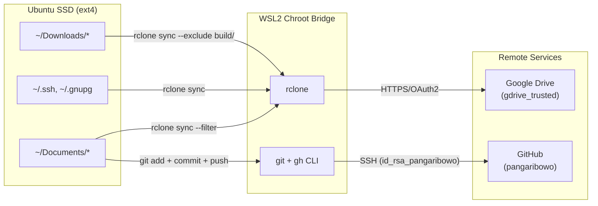

# Architecture: WSL2 Chroot Bridge & SSD I/O Internals

## 1. System Architecture Overview

This document describes the low-level mechanics of how a dormant Ubuntu installation on an external USB SSD is made operational from within a Windows host, without booting the guest OS.

```
┌──────────────────────────────────────────────────────────────────┐
│                     WINDOWS HOST (Ring 3)                        │
│                                                                  │
│  ┌─────────────┐  ┌────────────┐  ┌───────────┐  ┌───────────┐ │
│  │ PowerShell  │  │ Git Bash   │  │  PuTTY    │  │ Win Term  │ │
│  └──────┬──────┘  └─────┬──────┘  └─────┬─────┘  └─────┬─────┘ │
│         │               │               │               │       │
│         └───────────┬───┘               │               │       │
│                     │                   │               │       │
│              ┌──────▼──────┐     ┌──────▼──────┐        │       │
│              │ wsl.exe     │     │ ssh.exe     │        │       │
│              │ (CLI proxy) │     │ (OpenSSH)   │        │       │
│              └──────┬──────┘     └──────┬──────┘        │       │
├─────────────────────┼──────────────────┼────────────────┼───────┤
│                HYPER-V VIRTUALIZATION BOUNDARY                   │
├─────────────────────┼──────────────────┼────────────────┼───────┤
│              ┌──────▼──────────────────▼────────────────▼─────┐ │
│              │         WSL2 LIGHTWEIGHT VM                     │ │
│              │    Linux Kernel 6.18.33.2-microsoft-standard    │ │
│              │                                                 │ │
│              │  ┌───────────────────────────────────────────┐  │ │
│              │  │     9P Protocol File Server (Plan 9)      │  │ │
│              │  │  /mnt/host/c ←→ C:\ (Windows NTFS)       │  │ │
│              │  └───────────────────────────────────────────┘  │ │
│              │                                                 │ │
│              │  ┌───────────────────────────────────────────┐  │ │
│              │  │    Block Device Passthrough (virtio-blk)   │  │ │
│              │  │  /dev/sdd ← \\.\PHYSICALDRIVE1 (USB SSD)  │  │ │
│              │  │  /dev/sdd4 → ext4 mount (rw,relatime)     │  │ │
│              │  └───────────────────────────────────────────┘  │ │
│              │                                                 │ │
│              │  ┌───────────────────────────────────────────┐  │ │
│              │  │          CHROOT ENVIRONMENT                │  │ │
│              │  │  Root: /mnt/host/wsl/PHYSICALDRIVE1p4      │  │ │
│              │  │                                            │  │ │
│              │  │  Bind Mounts:                              │  │ │
│              │  │    /proc  ← procfs  (process info)        │  │ │
│              │  │    /sys   ← sysfs   (device info)         │  │ │
│              │  │    /dev   ← devtmpfs (device nodes)       │  │ │
│              │  │    /dev/pts ← devpts (pseudo-terminals)   │  │ │
│              │  │    /run   ← tmpfs   (runtime state)       │  │ │
│              │  │                                            │  │ │
│              │  │  ┌────────────────────────────────────┐   │  │ │
│              │  │  │  Ubuntu 22.04 Userspace            │   │  │ │
│              │  │  │  User: bakung (UID 1000)           │   │  │ │
│              │  │  │  Shell: /usr/bin/zsh + Oh My Posh  │   │  │ │
│              │  │  │  sshd: port 2222 (optional)        │   │  │ │
│              │  │  └────────────────────────────────────┘   │  │ │
│              │  └───────────────────────────────────────────┘  │ │
│              └─────────────────────────────────────────────────┘ │
└──────────────────────────────────────────────────────────────────┘
```

---

## 2. Physical Disk Passthrough Mechanics

### 2.1 The `wsl --mount` Pipeline

When `wsl --mount \\.\PHYSICALDRIVE1 --partition 4` is executed:

1. **Windows Kernel (ntoskrnl.exe)** opens a handle to the raw physical disk `\\.\PHYSICALDRIVE1` via the USB Mass Storage driver stack.
2. **Hyper-V** creates a virtual SCSI (virtio-blk) device and attaches the physical disk to the WSL2 VM's virtual bus.
3. **Linux Kernel** inside WSL2 detects the new block device as `/dev/sddN` and reads the GPT partition table.
4. **ext4 driver** mounts partition 4 at the WSL-generated mount point `/mnt/host/wsl/PHYSICALDRIVE1p4`.

```
Physical Layer:
  USB 3.0 → ADATA SU650 (SATA-to-USB bridge: ASM1153E chipset)
       ↓
Windows Layer:
  USBSTOR.SYS → Disk.sys → \\.\PHYSICALDRIVE1
       ↓
Hyper-V Layer:
  Virtual SCSI Host Adapter → virtio-blk attachment
       ↓
WSL2 Linux Kernel:
  sd_mod → /dev/sdd → GPT → /dev/sdd4
       ↓
Filesystem:
  ext4 → mount -t ext4 /dev/sdd4 /mnt/host/wsl/PHYSICALDRIVE1p4
```

### 2.2 Read-Write Remount

By default, WSL2 may mount the disk read-only for safety. To enable writes:

```bash
mount -o remount,rw /mnt/host/wsl/PHYSICALDRIVE1p4
```

This modifies the VFS superblock flags in-kernel without unmounting, transitioning from `ro` to `rw` mode.

---

## 3. Chroot Bridge — How It Works

### 3.1 What `chroot` Actually Does

`chroot(2)` is a Linux system call that changes the apparent root directory (`/`) for the calling process and all its children. When we execute:

```bash
chroot /mnt/host/wsl/PHYSICALDRIVE1p4 su -l bakung
```

The kernel performs:

1. **`chroot(2)`**: Sets `current->fs->root` to point at the inode of `/mnt/host/wsl/PHYSICALDRIVE1p4`. All subsequent path resolutions starting with `/` are now relative to this new root.
2. **`su -l bakung`**: PAM authenticates user `bakung` (UID 1000), sets supplementary groups, and spawns a login shell (`/usr/bin/zsh`) with the user's environment (`HOME=/home/bakung`, `SHELL=/usr/bin/zsh`).

### 3.2 Why Pseudo-Filesystems Must Be Bind-Mounted

The chroot environment is a static filesystem tree. Without bind-mounting dynamic kernel interfaces, critical subsystems fail:

| Pseudo-FS | Purpose | Failure Without It |
|:---|:---|:---|
| `/proc` (procfs) | Process info, PID namespace, `/proc/self/fd/*` | Zsh crashes: `no such file or directory: /proc/self/fd/17`; Oh My Posh cannot detect terminal capabilities |
| `/sys` (sysfs) | Kernel device/module info | `udevadm`, hardware detection fail |
| `/dev` (devtmpfs) | Device nodes (`/dev/null`, `/dev/urandom`, `/dev/tty`) | Programs cannot open standard devices; `ssh-keygen` fails |
| `/dev/pts` (devpts) | Pseudo-terminal allocation | Interactive shells cannot allocate PTYs; SSH sessions fail to spawn |
| `/run` (tmpfs) | Runtime state (PID files, sockets, `sshd.pid`) | `sshd` cannot create PID file; DBus socket missing |

The `enter.sh` script automates all bind mounts using `mountpoint -q` guards to prevent double-mounting:

```bash
mountpoint -q "$ROOT/proc" || mount -t proc proc "$ROOT/proc"
mountpoint -q "$ROOT/sys" || mount -t sysfs sys "$ROOT/sys"
mountpoint -q "$ROOT/dev" || mount --bind /dev "$ROOT/dev"
mountpoint -q "$ROOT/dev/pts" || mount --bind /dev/pts "$ROOT/dev/pts"
mountpoint -q "$ROOT/run" || mount --bind /run "$ROOT/run"
```

### 3.3 Multi-Terminal Support

Each invocation of `chroot ... su -l bakung` creates an **independent process tree**:

```
WSL2 init (PID 1)
├── chroot session 1 → su → zsh (PTY /dev/pts/1)
├── chroot session 2 → su → zsh (PTY /dev/pts/2)
├── chroot session 3 → su → zsh (PTY /dev/pts/3)
└── chroot sshd (PID N) → sshd fork → zsh (PTY /dev/pts/4)
```

Each session gets its own PTY allocation from the shared `/dev/pts` mount. There is no session limit beyond available memory and PTY device numbers (default: 4096).

---

## 4. SSH Tunnel Architecture

### 4.1 sshd Inside Chroot

When `start_sshd.sh` runs:

```bash
chroot "$ROOT" /usr/sbin/sshd -D -p 2222
```

1. `sshd` starts inside the chroot, listening on `0.0.0.0:2222`.
2. Because the chroot shares the WSL2 VM's network namespace (no separate `unshare(CLONE_NEWNET)`), the socket is visible to the entire VM.
3. WSL2 has built-in **localhost forwarding** — any TCP port listened on inside WSL2 is automatically accessible from `127.0.0.1` on the Windows host.

### 4.2 Connection Flow

```
PuTTY (Windows)
  → TCP connect 127.0.0.1:2222
  → WSL2 localhost forwarding
  → Linux kernel TCP stack → socket in chroot
  → sshd (Ubuntu) → PAM auth → su bakung
  → /usr/bin/zsh (interactive login shell)
```

**Latency:** < 1ms (localhost loopback through Hyper-V virtual switch).

---

## 5. I/O Optimization for DRAM-less SSDs

### 5.1 The DRAM-less Problem

The ADATA SU650 uses **TLC NAND** without a DRAM cache chip. This means:

- **No Flash Translation Layer (FTL) cache** — Every write goes through the slower HMB (Host Memory Buffer) or directly to NAND pages.
- **Write amplification factor (WAF)** is higher because the controller cannot batch small writes efficiently.
- **Random 4K write IOPS** drops significantly under sustained load compared to DRAM-equipped SSDs.

### 5.2 Kernel Parameter Tuning

```ini
# /etc/sysctl.d/99-ssd-optimized.conf

# Reduce swap aggressiveness (lower = prefer RAM over disk)
vm.swappiness = 150

# Batch dirty pages longer before flushing (reduces write frequency)
vm.dirty_expire_centisecs = 6000    # 60 seconds (default: 30)
vm.dirty_writeback_centisecs = 1500  # 15 seconds (default: 5)
```

### 5.3 fstab Commit Interval

```
# Before (dangerous for DRAM-less SSD):
UUID=xxx /  ext4  errors=remount-ro,commit=3  0 1

# After (safe batched writes):
UUID=xxx /  ext4  errors=remount-ro,commit=60  0 1
```

The `commit=N` parameter controls how frequently the ext4 journal is flushed to disk. On a DRAM-less SSD, `commit=3` (every 3 seconds) causes excessive small writes. `commit=60` batches journal commits into 60-second windows, dramatically reducing write operations while still maintaining data integrity on clean shutdown.

### 5.4 Tracker3 Indexer — The Silent I/O Killer

GNOME's `tracker-miner-fs-3` monitors all file changes via `inotify` and writes metadata to a Tracker database. On a DRAM-less SSD, this creates a constant background I/O storm:

```bash
# Disable tracker3 globally
systemctl --user mask tracker-miner-fs-3.service
systemctl --user mask tracker-extract-3.service

# Verify
tracker3 status  # Should show "Unavailable"
```

---

## 6. Data Flow — Backup & Sync Pipeline



### Filtering Rules

rclone sync operations explicitly exclude regenerable artifacts:

```
--exclude 'node_modules/**'
--exclude 'build/**'
--exclude 'dist/**'
--exclude '.angular/**'
--exclude '.next/**'
--exclude 'venv/**'
--exclude '*.AppImage'
--exclude '*.tar.gz'
```

---

## 7. Security Considerations

| Aspect | Implementation |
|:---|:---|
| **SSH Key Authentication** | `id_rsa_pangaribowo` (RSA 4096-bit) for GitHub; `id_rsa` (RSA 3072-bit) for server access |
| **sshd Port** | Non-standard port 2222 (reduces automated scan noise) |
| **sshd Scope** | Runs only inside chroot; terminates when batch script window is closed |
| **Credential Storage** | `.ssh/`, `.gnupg/`, `.password-store/` backed up to private Google Drive; `private-infra` repo is GitHub Private |
| **Network Exposure** | sshd binds to `0.0.0.0:2222` but is only reachable via WSL2 localhost forwarding — not exposed to LAN or WAN |

---

## 8. Complexity & Trade-offs

| Approach | Complexity | Capability | Isolation | Persistence |
|:---|:---:|:---:|:---:|:---:|
| **Direct WSL2 chroot** (our approach) | O(1) setup | Full userspace | Shared kernel | Session-based |
| **systemd-nspawn container** | O(n) config | Full systemd | Namespace-isolated | Service-managed |
| **Full VM (Hyper-V/VirtualBox)** | O(n²) resources | Complete OS boot | Full isolation | Persistent |
| **Native dual-boot** | O(1) reboot | Full native | Complete | Native |

The chroot approach provides the **optimal trade-off** for this use case: minimal setup complexity with full userspace access, at the cost of shared kernel (which is acceptable since both environments trust the same operator).

---

## 9. DNS Architecture: Dual-Boot Isolation vs Chroot Nameservers

### 9.1 The Split-Environment DNS Problem

A dual-boot root filesystem requires two completely mutually exclusive DNS configurations depending on its runtime context:

1. **In Bare-Metal Boot:** The OS uses `systemd-resolved` with a local caching stub listener on `127.0.0.53:53`, dynamically updating upstream nameservers based on DHCP leases from the active Wi-Fi/Ethernet interface.
2. **In WSL2 Chroot:** `systemd-resolved` is not running. The chroot environment must resolve queries via WSL2's internal Hyper-V NAT gateway (e.g., `172.28.128.1:53` or the host's VPN DNS).

### 9.2 The VFS Inode Masking Solution

To prevent cross-environment configuration corruption, the chroot entry script uses Linux Virtual File System (VFS) mount namespace overlaying:

```
ext4 Disk Surface (Persistent Storage):
  inode 1835009: /etc/resolv.conf -> ../run/systemd/resolve/stub-resolv.conf [SYMLINK]
       │
       ▼ (During Bare-Metal Boot)
  glibc reads /etc/resolv.conf → resolves to 127.0.0.53:53 → systemd-resolved OK

       │
       ▼ (During WSL2 Chroot Session)
  mount --bind /etc/resolv.conf /mnt/host/wsl/PHYSICALDRIVE1p4/etc/resolv.conf
       │
       ▼ (VFS Memory Layer)
  VFS dentry masked with WSL2 host's active resolv.conf (172.28.128.1)
  underlying ext4 inode remains 100% UNTOUCHED
       │
       ▼ (During Safe Eject / Teardown)
  umount /mnt/host/wsl/PHYSICALDRIVE1p4/etc/resolv.conf
  ext4 symlink instantly re-exposed for next bare-metal boot
```

This pattern ensures zero disk state pollution and guarantees that native Wi-Fi DNS works immediately upon rebooting into Linux.

