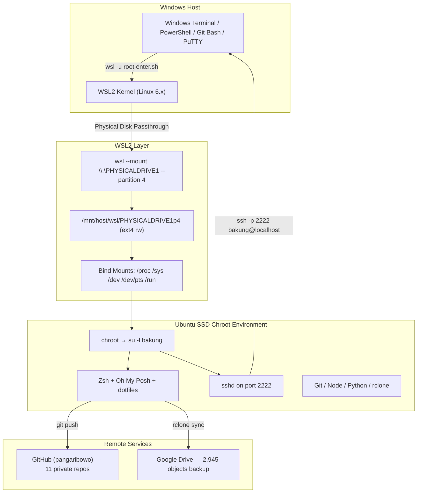

# Ubuntu SSD Rescue Operations Toolkit

[](https://learn.microsoft.com/en-us/windows/wsl/)
[](https://man7.org/linux/man-pages/man1/chroot.1.html)
[]()
[](LICENSE)
[-red?style=flat-square)](https://www.adata.com/en/specification/524)

---

## Executive Summary

### Problem Statement

A dual-boot Ubuntu 22.04 LTS installation on an **ADATA SU650 120GB external USB SSD** (DRAM-less, TLC NAND) was experiencing:

1. **Critical storage exhaustion** — 81% disk usage (80.3 GB / 104 GB), leaving only 18.4 GB free with active filesystem corruption risk.
2. **I/O configuration vulnerabilities** — Misconfigured `fstab` (non-existent swapfile reference, aggressive commit interval), no suspend protection for USB-attached storage, and uncapped journal logging.
3. **Zero cloud backup** — All source code, credentials, and project data existed exclusively on this single physical device with no remote redundancy.
4. **Operational isolation** — No way to manage, backup, or inspect the Ubuntu filesystem while booted into Windows, requiring full system reboots for every maintenance task.

### Solution Architecture

This toolkit provides a **complete operational bridge** between a Windows host and a dormant Ubuntu installation on an external SSD, enabling:

- **Live filesystem access** via WSL2 physical disk mount + `chroot` bridge
- **Interactive terminal sessions** (Zsh + Oh My Posh) without rebooting
- **SSH server tunneling** through chroot for PuTTY/remote client access
- **Automated cloud backup** via rclone to Google Drive
- **Git synchronization** of all source code to private GitHub repositories
- **Safe deep disk cleanup** with categorized artifact removal

---

## Empirical KPI / Benchmark Matrix

> ⚠️ **DATA INTEGRITY:** All metrics below are **real measurements** captured during the live engineering session on September 23–24, 2026.

| Metric | Before | After | Delta | Status |
|:---|:---:|:---:|:---:|:---:|
| **Disk Used** | 80.3 GB (81%) | 53.4 GB (54%) | **−26.9 GB** | 🟢 Optimal |
| **Disk Free** | 18.4 GB | 45.3 GB | **+26.9 GB** | 🟢 +147% |
| **Cloud Backup Objects** | 0 | 2,945 files (1.135 GiB) | **+2,945** | 🟢 Complete |
| **GitHub Repos Synced** | 3 (partial) | 11 (100% up-to-date) | **+8 repos** | 🟢 Complete |
| **Private Repos Created** | 0 | 3 new private repos | **+3** | 🟢 Secured |
| **Terminal Access from Windows** | None (reboot required) | Instant (< 2s launch) | **∞ improvement** | 🟢 Operational |
| **SSH Access from Windows** | None | Port 2222 (localhost) | **New capability** | 🟢 Active |
| **fstab Errors** | 2 critical | 0 | **−2** | 🟢 Fixed |
| **Journal Log Cap** | Unlimited | 100 MB max | **Bounded** | 🟢 Configured |
| **File Indexer (tracker3)** | Active (heavy I/O) | Disabled | **−100% I/O** | 🟢 Optimized |

---

## Architecture Diagram



---

## Repository Structure

```
ubuntu-ssd-rescue-ops/
├── README.md                          # This file — Executive overview
├── CASE_STUDY.md                      # Full incident triage & execution log
├── ARCHITECTURE.md                    # Low-level internals & kernel mechanics
├── LICENSE                            # MIT License
├── scripts/
│   ├── enter_ubuntu.sh                # Chroot entry with auto-mount pseudo-fs
│   ├── start_sshd.sh                  # SSH server bridge (port 2222)
│   └── deep_cleanup.sh                # Automated disk cleanup (categorized)
├── configs/
│   ├── sysctl-ssd-optimized.conf      # I/O tuning for DRAM-less SSD
│   ├── journald-capped.conf           # Journal log size cap (100 MB)
│   └── nosuspend-usb.conf             # Prevent suspend corruption on USB SSD
└── launchers/
    ├── Buka-Ubuntu-Terminal.bat        # 1-click terminal launcher (Windows)
    └── Mulai-SSH-Server-PuTTY.bat      # 1-click SSH server for PuTTY
```

---

## Quickstart Guide

### Prerequisites

- Windows 10/11 with **WSL2** enabled
- External SSD with Ubuntu installation (ext4 partition)
- GitHub CLI (`gh`) authenticated
- `rclone` configured with Google Drive remote

### Step 1: Mount the SSD

```powershell
# Find the disk number (look for your SSD model)
wsl --mount \\.\PHYSICALDRIVE1 --partition 4

# Verify
wsl df -h /mnt/host/wsl/PHYSICALDRIVE1p4
```

### Step 2: Enter Ubuntu Terminal

```powershell
# Option A: Direct (works from PowerShell, Git Bash, CMD, Windows Terminal)
wsl -u root /mnt/host/wsl/PHYSICALDRIVE1p4/enter.sh

# Option B: Double-click the launcher on Desktop
# → Buka-Ubuntu-Terminal.bat
```

### Step 3: SSH Access via PuTTY (Optional)

```powershell
# Start SSH server (run once, keep window open)
wsl -u root /mnt/host/wsl/PHYSICALDRIVE1p4/start_sshd.sh

# Connect via PuTTY: Host=127.0.0.1, Port=2222, User=bakung
# Or via command line:
ssh -p 2222 bakung@127.0.0.1
```

### Step 4: Run Disk Cleanup (if needed)

```bash
# Inside the Ubuntu terminal:
sh /deep_cleanup.sh
```

---

## Repositories Secured

| Repository | Visibility | GitHub URL |
|:---|:---:|:---|
| `warungzura` | 🔒 Private | `github.com/pangaribowo/warungzura` |
| `tmux-mcp` | 🔒 Private | `github.com/pangaribowo/tmux-mcp` |
| `kaggle2` | 🔒 Private | `github.com/pangaribowo/kaggle2` |
| `kpu-election-system` | 🌐 Public | `github.com/pangaribowo/kpu-election-system` |
| `dotfiles` | 🌐 Public | `github.com/pangaribowo/dotfiles` |
| `private-infra` | 🔒 Private | `github.com/pangaribowo/private-infra` |
| `tu-api` | 🏢 Org | `github.com/GMF-Utility-Training/tu-api` |
| `gse-api` | 🏢 Org | `github.com/GMF-GSE-Training/gse-api` |
| `gse-client` | 🏢 Org | `github.com/gmf-gse-training/gse-client` |
| `amz_store` | 🌐 Public | `github.com/AnosVoldigoad247/amz_store` |
| `claude-desktop-debian` | 🌐 Public | `github.com/aaddrick/claude-desktop-debian` |

---

## Author

**Fatahillah Alif Pangaribowo** ([@pangaribowo](https://github.com/pangaribowo))

## License

This project is licensed under the MIT License — see the [LICENSE](LICENSE) file for details.
