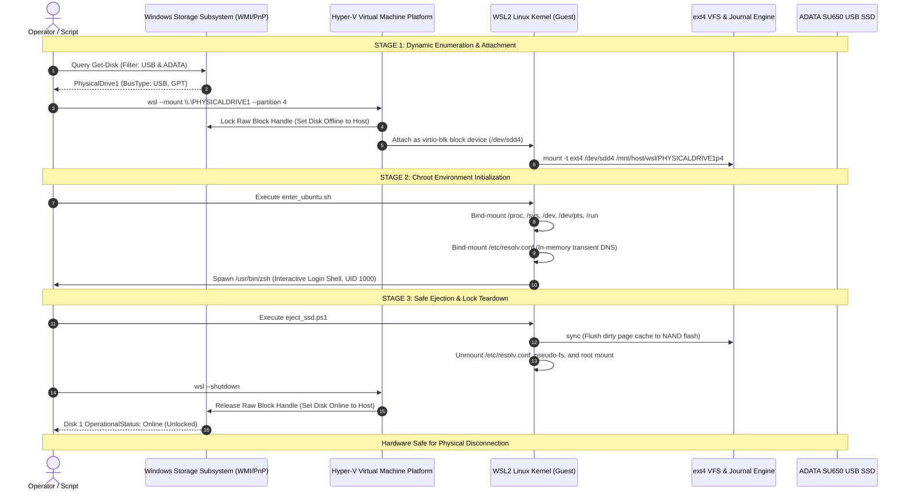

# System Runbook: External ext4 Storage Lifecycle via WSL2 Passthrough

## 1. Architectural Pipeline Overview

Managing a bare-metal Linux installation on an external USB SSD from a Windows host involves crossing multiple virtualization and storage driver abstraction layers:



---

## 2. Stage Breakdown & Edge Cases

### 2.1 Non-Deterministic PhysicalDrive Indexing

Windows does not guarantee static physical drive indexes across reboot cycles or multiple USB plug/unplug events. An external SSD recognized as `\\.\PHYSICALDRIVE1` can easily become `\\.\PHYSICALDRIVE2` if another flash drive, SD card, or virtual drive is attached first.

**Robust Detection Pattern (`scripts/mount_ssd.ps1`):**
```powershell
# Dynamically query the storage controller via WMI
$disk = Get-Disk | Where-Object { $_.FriendlyName -like '*ADATA*' -and $_.BusType -eq 'USB' }
if (-not $disk) {
    Write-Error "Target SSD not detected on USB bus."
    exit 1
}
$diskNum = $disk.Number
# Guarantees correct target: \\.\PHYSICALDRIVE$diskNum
```

---

### 2.2 The File Locking Dilemma (Why Windows Eject Fails)

When Windows users attempt to click "Safely Remove Hardware and Eject Media" while the disk is attached to WSL2, Windows displays:

> *"The device is currently in use. Close any programs or windows that might be using the device, and then try again."*

#### Why This Occurs:
1. **Hyper-V Handle Hold:** The virtual machine platform maintains an exclusive lock (`GENERIC_READ | GENERIC_WRITE | FILE_SHARE_READ`) on the block handle to prevent host-guest write collisions.
2. **Open Inodes in Linux:** If any shell session, background daemon (`sshd`), or active working directory remains inside `/mnt/host/wsl/PHYSICALDRIVE*`, the Linux VFS cannot unmount the superblock (`EBUSY: Device or resource busy`).
3. **Mount Table State:** Even if all processes terminate, transient WSL processes leave the block device attached to the VM until an explicit `--unmount` or `--shutdown` signal is received by the WSL service host.

---

### 2.3 The Multi-Stage Teardown Protocol

To ensure 0% risk of ext4 journal corruption or unflushed dirty pages:

```
[Step 1: Application Teardown]
  Exit interactive shells (Zsh, Bash)
  Terminate background daemons (kill sshd)

[Step 2: Buffer Flush (VFS Barrier)]
  sync (Flushes ext4 journal transactions and page cache)

[Step 3: Recursive VFS Unmount]
  umount /mnt/host/wsl/PHYSICALDRIVE*p4/etc/resolv.conf
  umount /mnt/host/wsl/PHYSICALDRIVE*p4/run
  umount /mnt/host/wsl/PHYSICALDRIVE*p4/dev/pts
  umount /mnt/host/wsl/PHYSICALDRIVE*p4/dev
  umount /mnt/host/wsl/PHYSICALDRIVE*p4/sys
  umount /mnt/host/wsl/PHYSICALDRIVE*p4/proc
  umount /mnt/host/wsl/PHYSICALDRIVE*p4

[Step 4: Hyper-V VM Passthrough Release]
  wsl --shutdown

[Step 5: Host Verification]
  Verify Get-Disk status transitions from 'Offline' to 'Online'
  Hardware safe to disconnect
```

This entire sequence is fully automated within **`scripts/eject_ssd.ps1`** and triggered via the desktop launcher **`2-Cabut-Ubuntu-SSD-Aman.bat`**.
